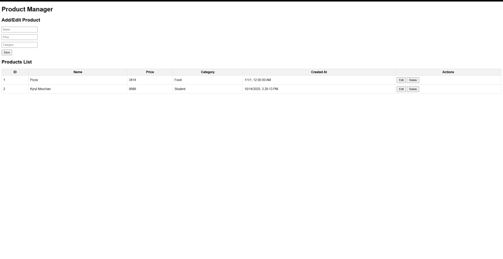

# projekt-CRUD-Kyryl-Movchan

Ten projekt to prosta aplikacja CRUD do zarządzania produktami, stworzona w ramach zadania.

## Użyte Technologie
-   **Backend**: C# z ASP.NET Core Web API
-   **Baza Danych**: SQLite z użyciem Entity Framework Core
-   **Frontend**: Podstawowy HTML, CSS i JavaScript

## Jak uruchomić lokalnie
1.  Sklonuj repozytorium.
2.  Otwórz terminal w głównym folderze projektu.
3.  Uruchom polecenie: `dotnet run`
4.  Otwórz przeglądarkę i przejdź pod adres URL wyświetlony w terminalu (np. `http://localhost:5262`).

## Endpointy API
Aplikacja udostępnia następujące endpointy REST API do zarządzania produktami:

-   `GET /api/products` - Pobiera listę wszystkich produktów.
-   `GET /api/products/{id}` - Pobiera pojedynczy produkt po jego ID.
-   `POST /api/products` - Tworzy nowy produkt.
-   `PUT /api/products/{id}` - Aktualizuje istniejący produkt.
-   `DELETE /api/products/{id}` - Usuwa produkt.

## Zrzut ekranu interfejsu
Poniżej znajduje się zrzut ekranu interfejsu użytkownika działającej aplikacji:

